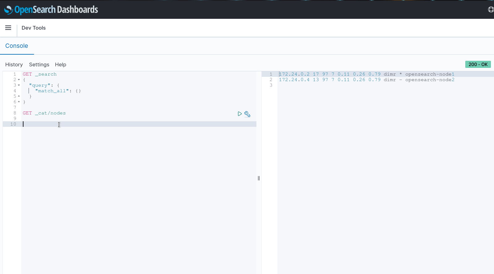

# Laboratório da Palestra sobre Opensearch

Heeey, se você chegou aqui, provavelmente é porquê assistiu minha palestra na Campus de Goiânia. Bora lá!

## Provisionamento de VM

Dentro da pasta provision, terá um Vagrantfile e um Ansible playbook para se caso precisar de uma VM para provisionar o cluster de Opensearch.

> Para subir a vm você precisa ter o **Vagrant** e **Virtual Box** instalado na sua máquina.

Para criar e subir a máquina basta executar:
```
$ vagrant up
```

### Docker compose

Para subir o cluster de Opensearch e Opensearch Dashboards basta utilizar o **docker-compose.yml** que está neste repor e subir os serviços:

```bash
docker-compose up -d
```


## Analisando dados no Opensearch

Assim que subir os serviços, o Opensearch Dashboards ficará disponível na porta 5601!

> Login: admin:admin


Vamos criar o índice e definir um mapeamento utilizando _search_as_you_type_:

> Você pode utilizar o DevTools do Opensearch Dashboards ou alguma ferramenta para fazer essas requisições (curl, insominia, postman ...)


```json
PUT /movies

{
   "mappings": {
       "properties": {
           "title": {
               "type": "search_as_you_type"
           },
           "genre": {
               "type": "search_as_you_type"
           }
       }
   }
}
```



Vamos utilizar um bulk request para adicionar alguns documentos:

```json
PUT /movies/_bulk/

{ "index":{} }
{ "title" : " Predestination", "year":2014 , "genre":["Action", "Drama", "Sci-Fi"] }
{ "index":{} }
{ "title" : "Star Wars: Episode VII - The Force Awakens", "year":2015 , "genre":["Action", "Adventure", "Fantasy", "Sci-Fi"] }
{ "index":{} }
{ "title" : "Interstellar", "year":2014 , "genre":["Sci-Fi", "Adventure", "Drama"] }
{ "index":{} }
{ "title" : "Venom", "year":2018 , "genre":["Action", " Adventure", "Sci-Fi"] }
{ "index":{} }
{ "title" : "A Quiet Place Part II", "year":2020 , "genre":["Horror", "Sci-Fi", "Drama"] }
{ "index":{} }
{ "title" : "Donnie Darko", "year":2001 , "genre":["Drama", "Sci-Fi", "Mistery"] }
{ "index":{} }
{ "title" : "Black Widow", "year":2021 , "genre":["Action", " Adventure", "Sci-Fi"] }
{ "index":{} }
{ "title" : "Nobody", "year":2021 , "genre":["Action", "Drama", "Crime"] }
{ "index":{} }
{ "title" : "The Dark Knight", "year":2008 , "genre":["Action", "Drama", "Crime"] }
{ "index":{} }
{ "title" : "Inception", "year":2010 , "genre":["Action", " Adventure", "Sci-Fi"] }
{ "index":{} }
{ "title" : " The Matrix", "year":1999 , "genre":["Action",  "Sci-Fi"] }
{ "index":{} }
{ "title" : "Avatar", "year":2009 , "genre":["Action", " Adventure", "Fantasy"] }
{ "index":{} }
{ "title" : "Ex Machina", "year":2014 , "genre":["Action", " Adventure", "Sci-Fi"] }
{ "index":{} }
{ "title" : " The Hobbit: An Unexpected Journey", "year":2012 , "genre":[" Adventure", "Fantasy"] }
{ "index":{} }
{ "title" : "Wonder Woman", "year":2017 , "genre":["Action", " Adventure", "Fantasy"] }
{ "index":{} }
{ "title" : "Doctor Strange in the Multiverse of Madness", "year":2022 , "genre":["Action", " Adventure", "Fantasy"] }
```

Com esses dados, já conseguimos utilizar o **search_as_you_type** para simular o processo de _autocomplete_. 

Exetute o Shell Script que está neste repositório e pesquise por algum filme:

