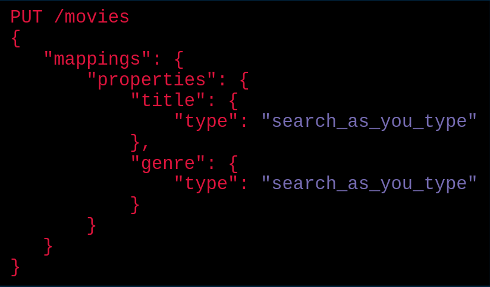
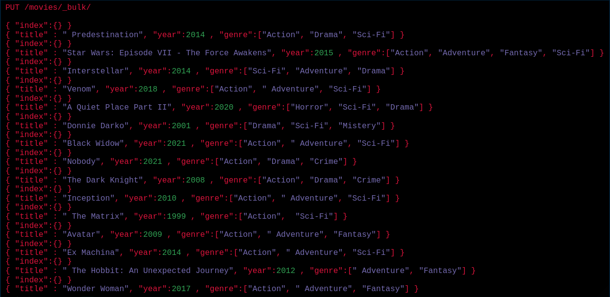

# **Opensearch**
## Ferramenta de Análise de dados poderosa e Opensource

---

#### Thaynara Mendes
- Analista Linux na 4linux
- Consultora de tecnologia na áreas de **Monitoramento** e **DevOps**
- Viciada em café e Linux ☕️🐧️

---

### SORTEIO NO FIM DA PALESTRA!

##### Inscreva-se e participe!
Escaneie o QRCode

---

> ##### O termo Software livre significa que os usuários possuem a liberdade de executar, copiar, distribuir, estudar, mudar e melhorar o software. Assim sendo, "software livre" é uma questão de liberdade, não de preço. Para entender o conceito, pense em "liberdade de expressão", não em "cerveja grátis".

*The Free Software Foundation*

---

# O que é Opensearch? 

O Opensearch é uma ferramenta de análise de dados, com ele você consegue realizar a injestão, busca, visualização dos seus dados.

---

## Como surgiu o Opensearch?

- Projeto Opendistro
- Mudança de Licença da Elastic
- Oportunidade de oferecer uma ferramenta totalmente opensource

---

### O que você ganha ao escolher o Opensearch?

- Segurança avançada
- Geração de alertas
- Geração de relatórios
- Detecção de anomalias

---

## O que você deixa de ganhar ao escolher o Opensearch?

- APM (Application Performance Monitoring)
- Lens
- SIEM

---

### Porque utilizar o Opensearch?

- Software livre
- Integração LDAP e Active Directory
- Detecção de anomalias

---

# Laboratório 👩🏾‍🔬

É só escanear ou acessar o link:
[https://github.com/thaycafe/opensearch_lab_CPGO](https://github.com/thaycafe/opensearch_lab_CPGO)

---

**1. Suba o Opensearch e Opensearch Dashboards com o Docker Compose**

---

**2. Acesse o Opensearch Dashboards e vá para a página de Dev Tools**

---
**3. Através do Dev Tools, crie o índice movies:**

---

---

**4. Através do Dev Tools, adicione dados via Bulk Insert**

---

**5. Faça a pesquisa utilizando o script de auto-complete**

---

# Obrigada!
  

 thaycafe
 thaycafee
 thaycafe
 thaynaramendss

